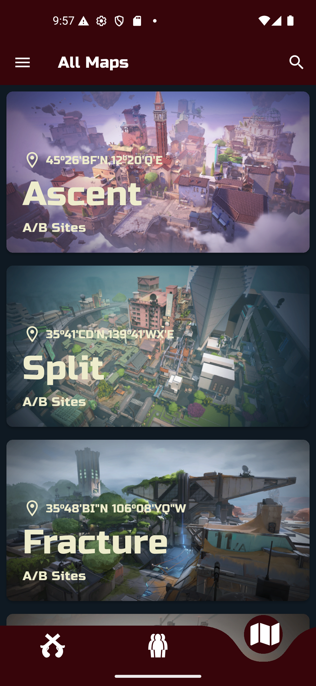
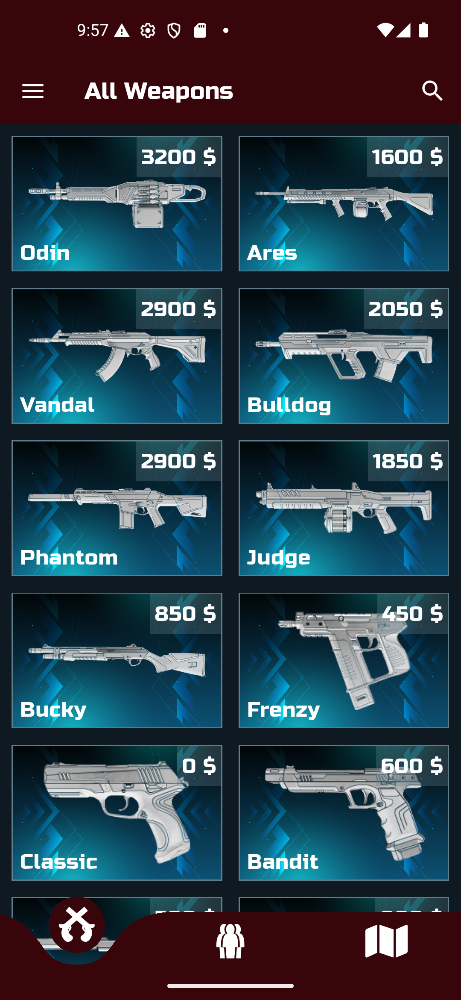
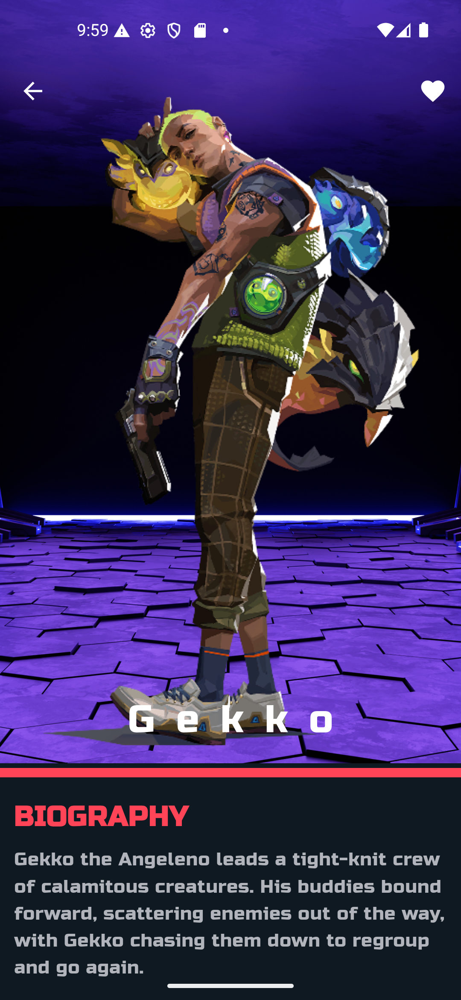
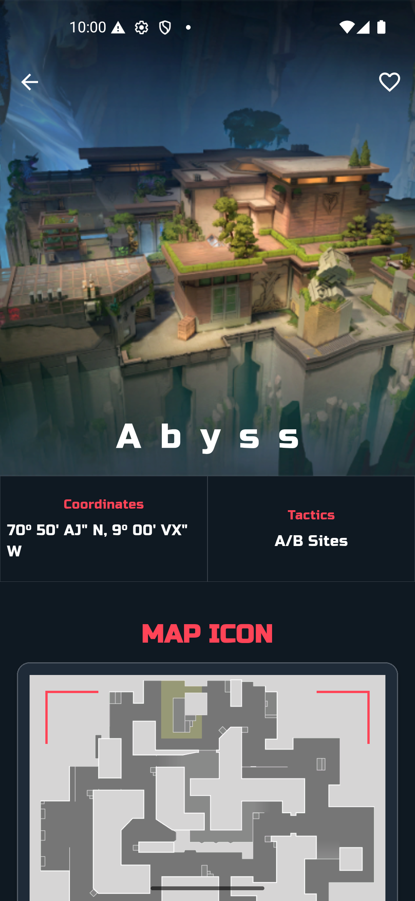
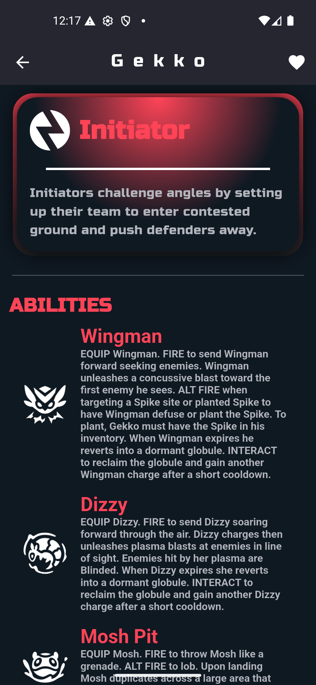
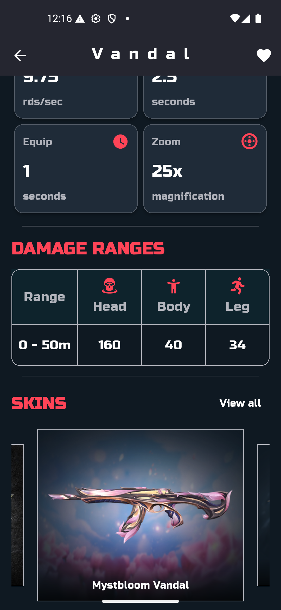
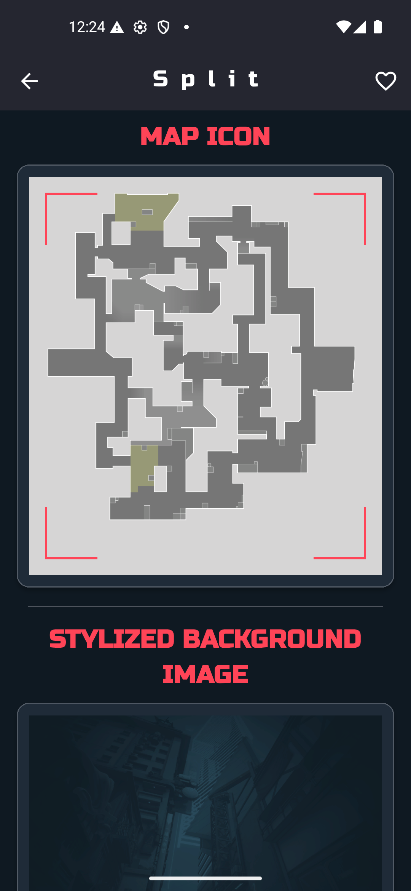
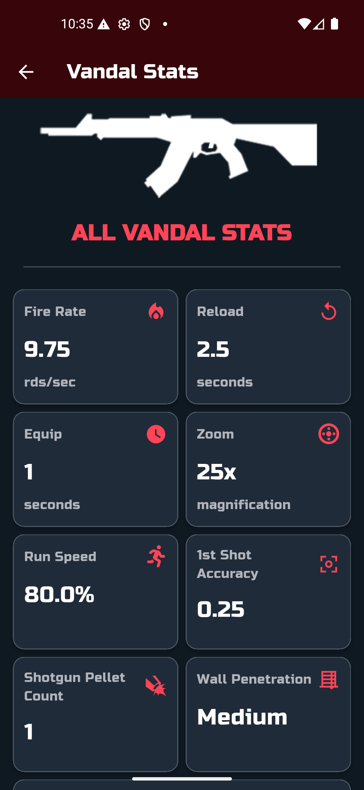
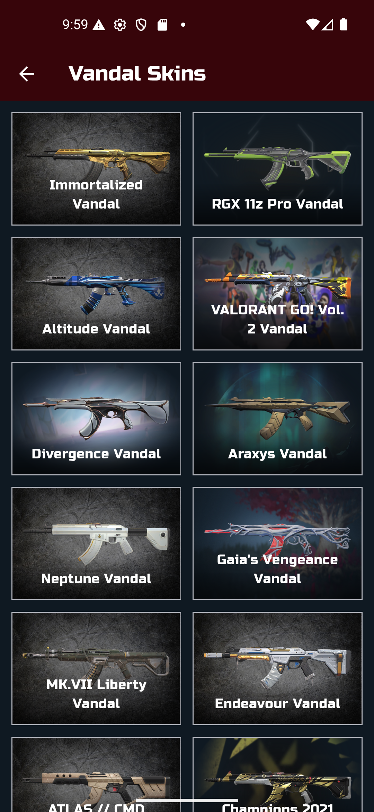
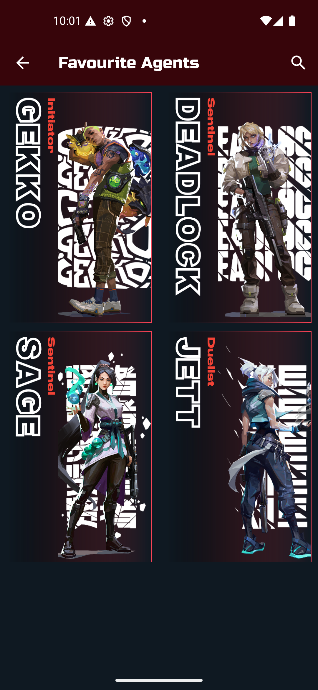

<p align="center">
  
</p>

<h1 align="center">Valopedia</h1>

<p align="center">
  A beautiful, feature-rich Valorant companion app built with Flutter — explore agents, maps, weapons, skins, and more.
</p>

<p align="center">
  
  
  
  <a href="https://valorant-api.com/">  </a>
</p>

---

## 🥷 About

**Valopedia** is a Valorant encyclopedia app that lets you browse all in-game agents, maps, and weapons with detailed information, statistics, and high-quality imagery.
> Looks clean, doesn't it? Yeah, I know 😎

## 🦍 Features

- **Agents** — Browse all agents in a grid layout with role labels, full-portrait details, biography, and ability breakdowns
- **Maps** — Explore maps with coordinates, tactical info, map icons, and stylized background images
- **Weapons** — View every weapon with pricing, detailed statistics (fire rate, reload, damage ranges, etc.), and a full skin gallery
- **Favourites** — Save your favourite agents, maps, and weapons for quick access
- **Search** — Search across agents, maps, and weapons with real-time filtering
- **Offline Detection** — Graceful handling when there's no internet connection

## 📸 Screenshots
> Screenshots don't do it justice. Trust me, bro 🫡

<table>
  <tr>
    <td align="center">
      
      <br><sub><b>Agents</b></sub>
    </td>
    <td align="center">
      
      <br><sub><b>Maps</b></sub>
    </td>
    <td align="center">
      
      <br><sub><b>Weapons</b></sub>
    </td>
  </tr>
  <tr>
    <td align="center">
      
      <br><sub><b>Agent Details</b></sub>
    </td>
    <td align="center">
      
      <br><sub><b>Map Details</b></sub>
    </td>
    <td align="center">
      
      <br><sub><b>Weapon Details</b></sub>
    </td>
  </tr>
  <tr>
    <td align="center">
      
      <br><sub><b>Agent Sliver Features</b></sub>
    </td>
    <td align="center">
      
      <br><sub><b>Weapon Sliver Features</b></sub>
    </td>
    <td align="center">
      
      <br><sub><b>Map Sliver Features</b></sub>
    </td>
  </tr>
  <tr>
    <td align="center">
      
      <br><sub><b>All Weapon Stats</b></sub>
    </td>
    <td align="center">
      
      <br><sub><b>Weapon Skins</b></sub>
    </td>
    <td align="center">
      
      <br><sub><b>Favourite Agents</b></sub>
    </td>
  </tr>

</table>

<p align="center"><i>Some very good stuff 🥵</i></p>

## 🏗️ Architecture

The project follows a clean, layered architecture with the **Cubit** pattern for state management:
> Don't just stare — clone it and run it 🏃‍♂️💨

```
lib/
├── business_logic/         # State management
│   └── cubit/
│       ├── agents/         # AgentsCubit & states
│       ├── maps/           # MapsCubit & states
│       ├── weapons/        # WeaponsCubit & states
│       └── favourites/     # FavouritesCubit & states
├── constants/              # Colors, fonts, strings
├── data/
│   ├── models/             # Data models (Agent, Map, Weapon)
│   ├── repository/         # Repository layer
│   └── web_services/       # API service (Dio)
├── presentation/
│   ├── agents/             # Agent screens & widgets
│   ├── maps/               # Map screens & widgets
│   ├── weapons/            # Weapon screens & widgets
│   ├── favourites/         # Favourite screens
│   └── common/             # Shared widgets
└── app_router.dart         # Named route configuration
```

## 🛠️ Tech Stack

| Category              | Technology                                                     |
|-----------------------|----------------------------------------------------------------|
| **Framework**         | Flutter 3.10+                                                  |
| **Language**          | Dart 3.10+                                                     |
| **State Management**  | flutter_bloc                                                   |
| **Architecture**      |	BLoC Pattern                                                   |
| **Networking**        | Dio                                                            |
| **API**               | valorant-api                                                   |

## 🥅 API

- Used this good API [Valorant API](https://valorant-api.com/).
 > Yeah that's it

## 📂 Key Dependencies

```yaml
flutter_bloc: ^9.1.1       # State management with Cubit pattern
dio: ^5.9.0                # HTTP client for API requests
cached_network_image: ^3.4.1  # Image loading & caching
skeletonizer: ^2.1.3       # Skeleton placeholder loaders
flutter_offline: ^6.0.0    # Offline connectivity detection
carousel_slider: ^5.1.2    # Weapon skins carousel
curved_navigation_bar: ^1.0.6  # Bottom navigation bar
google_fonts: ^6.3.2       # Google Fonts integration
flutter_svg: ^2.2.3        # SVG rendering for icons
flutter_native_splash: ^2.4.7  # Native splash screen
```
> ⚠️ **Warning:** This app contains some easter eggs that could cause a laugh overdose... good luck

---

 <p align="center"><b>If you scrolled this far, you're already an agent 🕵️... Thank you</b></p>
<p align="center">Made with ❤️, me and Flutter</p>
